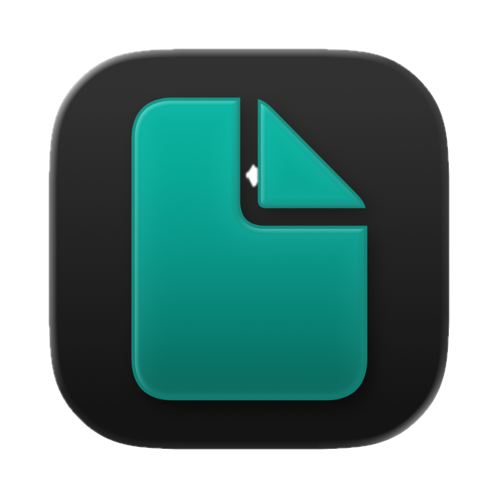
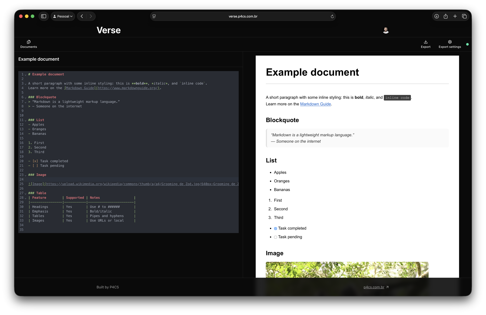

[](LICENSE)

<div align="center">
  
</div>

<div align="center">
  <h1>Verse Editor</h1>
</div>

<div align="center">
  
</div>

Verse is an open source markdown editor that allows you to export your document to PDF, HTML, or just the raw Markdown file.

The web app is built with a local-first approach, but your documents are also synced to the cloud so you can access them from anywhere.

There should be a simpler way to convert markdown into documents, and Verse is an attempt to do just that.

## Features

- Realtime preview of your markdown content with styling.
- Auto save functionality.
- Exporting to PDF, HTML and Markdown.

## For the future

### Priority

- Allow users to edit the styling of the document.
- Allow users to further customize the export settings.
- Add a custom image import feature via a toolbar button, to facilitate the inclusion of images in documents.

### Nice to have

- Markdown snippets insertion via a toolbar button.
- AI features to help with writing and styling.
- Support for extended markdown

## Extended Markdown Support

The preview now supports:

- GitHub Flavored Markdown (GFM)
- LaTeX math via KaTeX (inline and display)
- Mermaid.js diagrams

Examples:

- Inline math: `$E=mc^2$`

- Display math:

  $$
  \int_a^b f(x)\,dx
  $$

- Mermaid diagram:
  ```mermaid
  graph TD
    A[Start] --> B{Choice}
    B --> |Yes| C[Path 1]
    B --> |No| D[Path 2]
  ```

Notes:

- Math is rendered with KaTeX and styled automatically.
- Mermaid diagrams are rendered client‑side from sanitized HTML. Use triple backticks with the language set to `mermaid`.
- If you need a literal dollar sign in text, escape it like `\$` to avoid triggering inline math.
