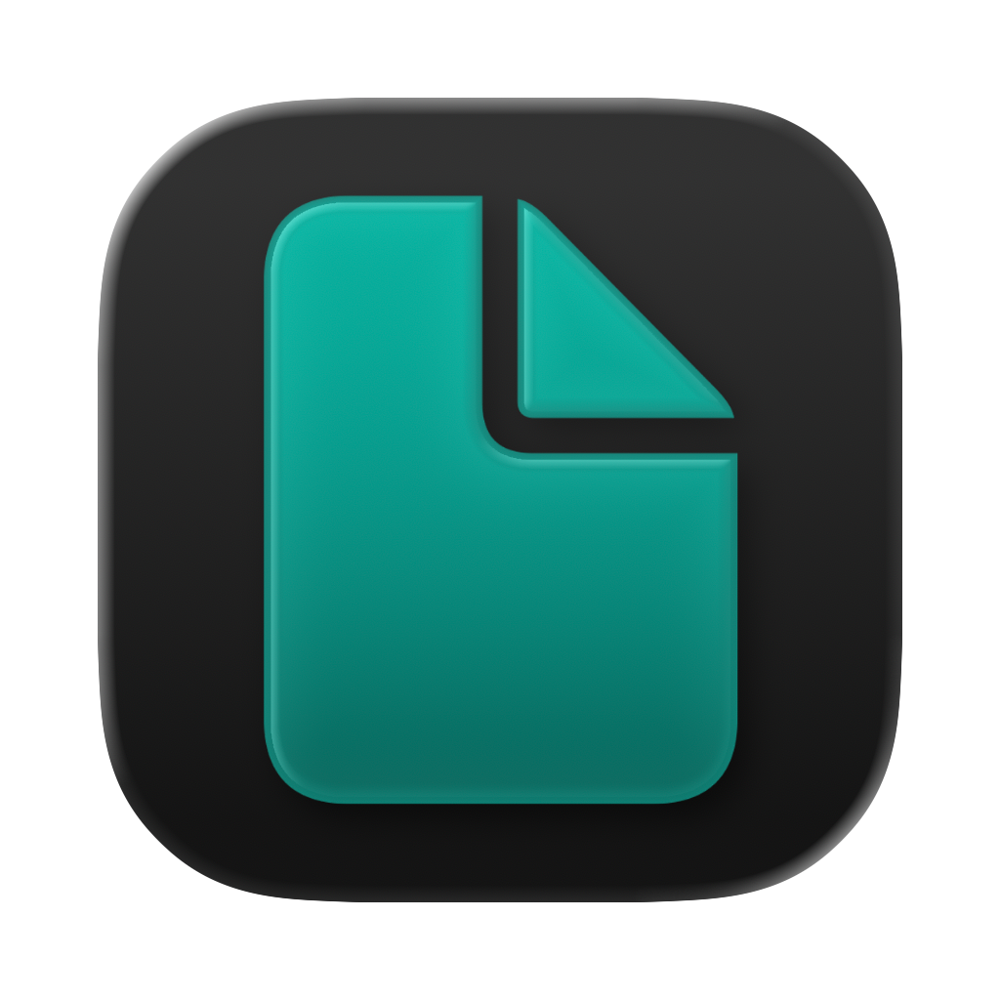

  

  <h1>Verse Web App</h1>

  

Verse is an open source markdown editor that allows you to export your document to PDF, HTML, or just the raw Markdown file.

The web app is built with a local-first approach, but your documents are also synced to the cloud so you can access them from anywhere.

There should be a simpler way to convert markdown into documents, and Verse is an attempt to do just that.

## Features

- Realtime preview of your markdown content with styling.
- Auto save functionality.
- Exporting to PDF, HTML and Markdown.

## For the future

### Priority

- Allow users to edit the styling of the document.
- Allow users to further customize the export settings.
- Add a custom image import feature via a toolbar button, to facilitate the inclusion of images in documents.

### Nice to have

- Markdown snippets insertion via a toolbar button.
- AI features to help with writing and styling.
- Support for extended markdown
